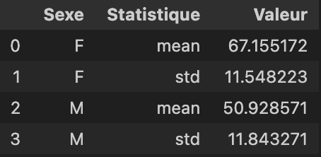

[](https://classroom.github.com/a/VIk3aFAc)
# TP3 -Analyse de données sur les AVC avec des librairies scientifiques

## Directives
:alarm_clock: Date de remise : Le 26 octobre 2025

À remettre sur Github (nous allons corriger votre dernier `git push` effectué avant la date limite)

## Introduction
Vous êtes chercheur(e) dans un laboratoire de recherche et vous étudiez l'incidence et la prévalence d'AVC chez différents groupes de patients ayant séjournés dans votre CIUSSS. Vous disposez d’une base de données `AVC.csv` contenant les informations suivantes :

- Patient ID : Identifiant unique du patient
- Âge : Âge du patient
- Sexe : M/F
- Type d’AVC : Ischémique, Hémorragique
- Date de survenue : Date de l’AVC
- Facteurs de risque : Hypertension, Diabète, Cholestérol élevé (Oui/Non)
- Durée d’hospitalisation : Nombre de jours


Votre objectif est de visualiser cette base de données à l'aide de représentations graphiques pour identifier l'incidence, la prévalence et les différences par sexe.  Pour ce faire, vous serez amenés à utiliser les librairies Python suivantes, qui sont fréquemment utilisées pour l'analyse et la visualisation de données : 

- Pandas: est une librairie Python qui permet de manipuler et analyser des données tabulaires grâce aux DataFrames, facilitant le nettoyage, le tri et le regroupement des données.

- Matplotlib : est une bibliothèque de base pour créer des graphiques 2D, tels que des courbes, histogrammes, scatter plots ou bar plots, offrant une grande flexibilité pour personnaliser l’apparence des figures.

- Seaborn : est une extension de Matplotlib qui permet de générer facilement des graphiques statistiques esthétiques comme des violin plots ou des boxplots, ce qui est très pratique pour explorer les relations entre variables et les distributions.  

- Plotly : est une librairie qui permet de permet de créer des graphiques interactifs, où l’utilisateur peut zoomer, survoler et filtrer les données, idéal pour des visualisations dynamiques.

Pour ce TP, nous allons travailler avec un Jupyter Notebook (`.ipynb`). 

## Qu'est-ce qu'un Jupyter Notebook ?
Un Jupyter Notebook est un environnement interactif utilisé pour écrire et exécuter du code, ainsi que pour visualiser des résultats en temps réel. Il permet d'intégrer à la fois du code, des commentaires textuels (Markdown), des visualisations et des équations mathématiques.

### Structure d'un Jupyter Notebook :
Un notebook se compose de cellules qui peuvent être :

- Cellules de code : Où vous écrivez et exécutez du code Python.
- Cellules Markdown : Où vous ajoutez des explications, des descriptions ou des notes en utilisant le langage Markdown, qui permet de formater du texte.

### Comment ça fonctionne :
Lorsqu'un Jupyter Notebook est ouvert, vous pouvez exécuter chaque cellule individuellement, ce qui permet une exécution étape par étape. Les résultats (comme les graphiques ou les variables calculées) sont affichés directement sous la cellule de code (au lieu d'un terminal). 

Il est également possible d'exécuter toutes les cellules l'une à la suite de l'autre avec le bouton "Run All" dans VS Code. 

## Installations requises
Avant de débuter ce TP, vous devez installer jupyter ainsi que l'extension de Jupyter Notebook dans VS Code. 

1. Pour installer jupyter, ouvrez un nouveau terminal dans VS Code et entrez la commande suivante : 

```bash
    pip install jupyter
```

2. Ensuite, installez l'extension Jupyter, si ce n'est pas déjà fait, et Jupyter Notebook dans VS Code :

- Allez à l'icône des extensions dans la barre latérale de gauche.
- Recherchez Jupyter.
- Installez l'extension Jupyter développée par Microsoft.

Elle devrait ressembler à ceci : 


Une fois jupyter et l'extension Jupyter Notebook installés, vous pouvez maintenant cloner ce répertoire et ouvrir le Jupyter Notebook intitulé `TP3.ipynb` et suivre les instructions pour réaliser le TP. 

Vous allez également devoir installer les 4 librairies mentionnées ci-haut, soit Pandas, Matplotlib, Seaborn et Plotly. Les instructions d'installation se retrouvent dans le Jupyter Notebook `TP3.ipynb`. 

## Instructions pour le TP
Les étapes détaillées et les instructions pour réaliser ce TP sont disponibles dans le Jupyter Notebook intitulé `TP3.ipynb`.
La section suivante fournit des exemples de résultats attendus pour chaque exercice, afin de vous aider à visualiser à quoi devraient ressembler vos réponses.

### Résultats attendus pour les exercices du TP

#### Partie 1 : Préparation des données 
Pour la partie 1, votre DataFrame initial devrait ressembler à ceci : 


Attention : l'affichage ne devrait PAS ressembler à ceci : 


Après la supression des colonnes, votre DataFrame devrait ressembler à ceci :


#### Partie 2 : Calcul des statistiques
Voici ce qui est attendu de l'afichage du nombre de cas d'AVC par catégorie: 


Voici un exemple de bonne solution pour l'utilisation de la fonction stats_par_groupe : 



Voici un exemple de bonne solution pour l'utilisation de la fonction proportion_hypertension_par_type_avc: 


#### Partie 3 : Visualisation des données
Voici un exemple de bonne solution pour le violin plot :


Voici un exemple de bonne solution pour le nuage de point interactif :


## Barème de correction

Le barème de correction pour ce TP est le suivant : 

| **Partie**                                | **Tâche**                                                                 | **Points** |
|-------------------------------------------|--------------------------------------------------------------------------|------------|
| **Partie 1 : Chargement et nettoyage des données avec pandas** |                                                                          | **/6**     |
|                                           | 1.1 Compléter la fonction `charger_donnees`                               | 1          |
|                                           | 1.2 Utiliser `charger_donnees` pour obtenir le DataFrame                  | 0.5        |
|                                           | 1.3 Affichage du DataFrame                                                | 0.5        |
|                                           | 1.4 Compléter la fonction `supprimer_colonnes`                            | 1          |
|                                           | 1.5 Utiliser `supprimer_colonnes` pour supprimer les colonnes "Diabète" et "Date_survenue" | 0.5 |
|                                           | 1.6 Affichage du DataFrame modifié                                        | 0.5        |
|                                           | 1.7 Compléter la fonction `majuscule`                                     | 1          |
|                                           | 1.8 Utiliser `majuscule` pour modifier la colonne Sexe                   | 0.5        |
|                                           | 1.9 Affichage du DataFrame après modification                              | 0.5        |
| **Partie 2 : Calcul des statistiques**    |                                                                          | **/5**     |
|                                           | 2.1 Affichage du nombre d'AVC par catégorie                                | 1          |
|                                           | 2.2 Compléter la fonction `stats_par_groupe`                               | 1          |
|                                           | 2.3 Affichage des statistiques avec `stats_par_groupe` (3 affichages à 0.5 chacun) | 1.5 |
|                                           | 2.4 Compléter la fonction `proportion_hypertension_par_type_avc`          | 1        |
|                                           | 2.5 Affichage du DataFrame avec proportions (%)                            | 0.5        |
| **Partie 3 : Visualisation des données**  |                                                                          | **/9**     |
|                                           | 3.1 Diagrammes en violon (subplot)                                        | 5          |
|                                           | - Utilisation du bon type de graphique et librairie                        | 1          |
|                                           | - Attribution des données sur les axes x et y                               | 1          |
|                                           | - Ajout des titres (titre principal et axes)                                | 1        |
|                                           | - Attribution des bonnes couleurs aux catégories                           | 1        |
|                                           | - Présentation des deux graphes côte à côte                                 | 1          |
|                                           | 3.2 Nuage de points 2D avec Plotly                                         | 4          |
|                                           | - Utilisation du bon type de graphique et librairie                        | 1          |
|                                           | - Attribution des données sur les axes x et y                               | 1        |
|                                           | - Différenciation des couleurs pour hommes et femmes                        | 1        |
|                                           | - Ajout des titres et centrage du titre                                     | 1          |
| **Bonus**                                 | Question bonus                                 | +1         |
| **Total**                                 |                                                                          | **/20**    |


* À noter que la note maximale est de 100% (donc si vous avez 20/20 + 1 point bonus, vous aurez quand même 20/20 sur le TP). 

